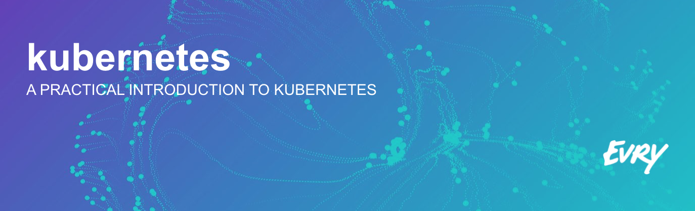

In this workshop you will learn how to:

* Set up a [Kubernetes][k8s] cluster locally using [Minikube][minik8s]
* Deploying applications and services using [`kubectl`][kubectl]
* Managing applications using the [Web UI (dashboard)][k8sui]

Kubernetes version: 1.6.4

## 1. Workshop setup

Windows users can follow this step-by-step [install guide for Windows](https://github.com/evry-bergen/kubernetes-workshop/wiki/Windows-Setup-Guide).

### 1.1 Set up Minikube

1. Download and install [VirtualBox][virtualboxdl].
2. Download and install [`kubectl`][kubectldl].
3. Download and install [Minikube][minik8sdl].
4. Download and install [curl][curldl].
5. Start minikube:

```
$ minikube start
```

### 1.2 Verify your setup

```
$ minikube version
$ minikube status
$ kubectl version
$ kubectl cluster-info
```

### 1.3 Clone this repo

Find a suited directory on your machine to clone this repository.

```
$ git clone https://github.com/evry-bergen/kubernetes-workshop.git
```

## 2. Labs

1. [Creating and Managing Pods](./labs/1-pods)
2. [Monitoring and Health Checks](./labs/2-health)
3. [Configurations and Secrets](./labs/3-config)
4. [Creating and Managing Services](./labs/4-services)
5. [Routing Ingress Traffic](./labs/5-ingress)
6. [Creating and Managing Deployments](./labs/6-deployments)
7. [Rolling out Updates](./labs/7-updates)

## 3. Reference

* [Kubernetes][k8s]
* [Kubernetes User Guide][k8sguide]
* [Kubernetes 101][k8s101]
* [Kubernetes 201][k8s201]
* [Kubernetes Master Components](k8scomponents)
* [`kubectl`][kubectl]
* [Docker][docker]

[curldl]: https://curl.haxx.se/dlwiz/?type=bin
[docker]: https://docs.docker.com/
[k8s101]: http://kubernetes.io/docs/user-guide/walkthrough/
[k8s201]: http://kubernetes.io/docs/user-guide/walkthrough/k8s201/
[k8s]: http://kubernetes.io/docs/
[k8scomponents]: http://kubernetes.io/docs/admin/cluster-components/
[k8sguide]: http://kubernetes.io/docs/user-guide/
[k8sui]: http://kubernetes.io/docs/user-guide/ui/
[kubectl]: http://kubernetes.io/docs/user-guide/kubectl-overview/
[kubectldl]: https://kubernetes.io/docs/tasks/tools/install-kubectl/#install-kubectl-binary-via-curl
[minik8s]: https://github.com/kubernetes/minikube
[minik8sdl]: https://github.com/kubernetes/minikube/releases/latest
[virtualboxdl]: https://www.virtualbox.org/wiki/Downloads
[windows]: https://github.com/evry-bergen/kubernetes-workshop/wiki/Windows-Setup-Guide
